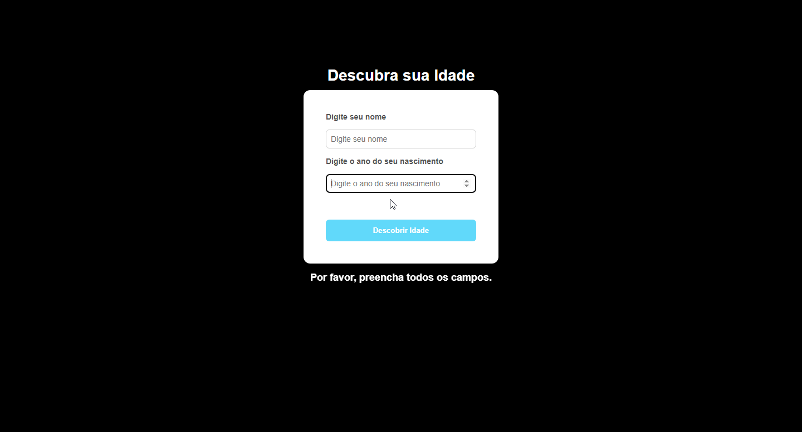

# 📌 Descubra sua Idade

Aplicação simples desenvolvida com **React + TypeScript** que permite ao usuário inserir seu nome e ano de nascimento para descobrir sua idade atual.

Este projeto foi criado com o objetivo de **praticar conceitos de React, TypeScript e estilização com CSS**, além de trabalhar boas práticas no desenvolvimento de interfaces web.

---

## 🚀 Tecnologias Utilizadas

- ⚛️ React
- 🔷 TypeScript
- 🎨 CSS3
- ⚡ Vite

---

## 📷 Demonstração

A aplicação permite:

- Inserir o **nome do usuário**
- Inserir o **ano de nascimento**
- Calcular automaticamente a **idade atual**
- Exibir o resultado na tela

---

## 🧠 Aprendizados

Durante o desenvolvimento deste projeto foram praticados conceitos como:

- Uso de **useState** no React
- Manipulação de eventos
- Componentes funcionais
- Estruturação de layout com **Flexbox**
- Estilização com CSS
- Tipagem com **TypeScript**

---

